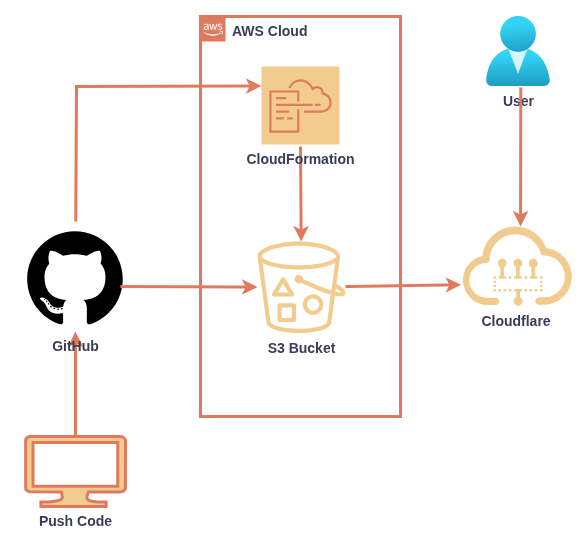

# Github Actions, CloudFormation, S3 and CloudFlare

**Let's automate static website hosting in AWS S3 with Github Actions, and CloudFormation.**

---
## Architecture 

---
### Workflow

- Push code 
- Create CloudFormation stack  to provision S3 with static website hosting enabled
- Copy public files to s3 bucket
- Update DNS Records in cloudflare

---

